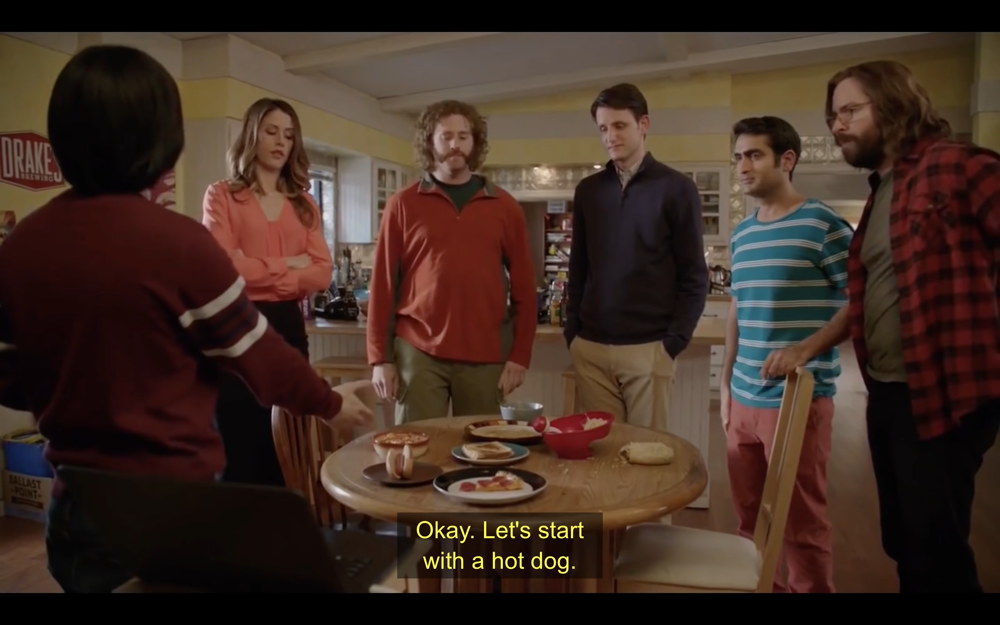
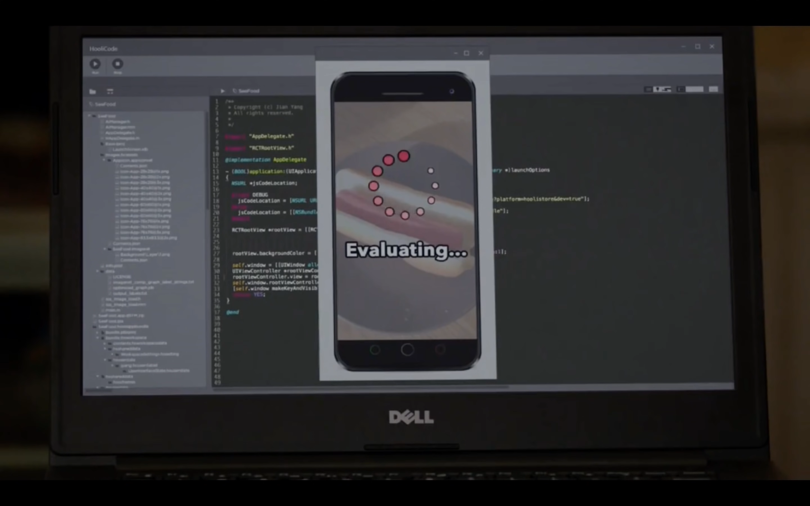
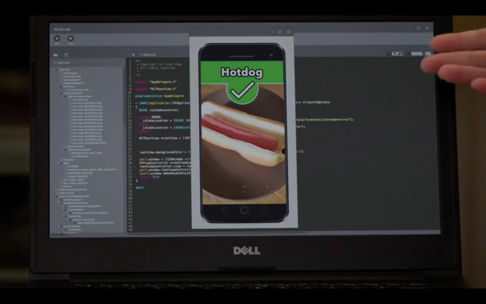
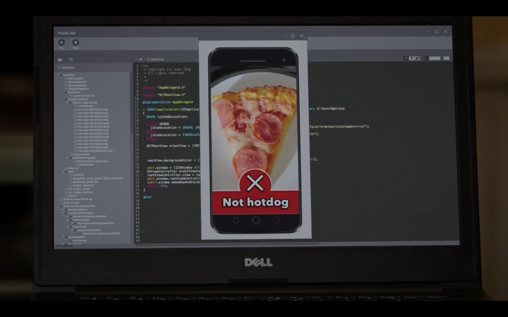
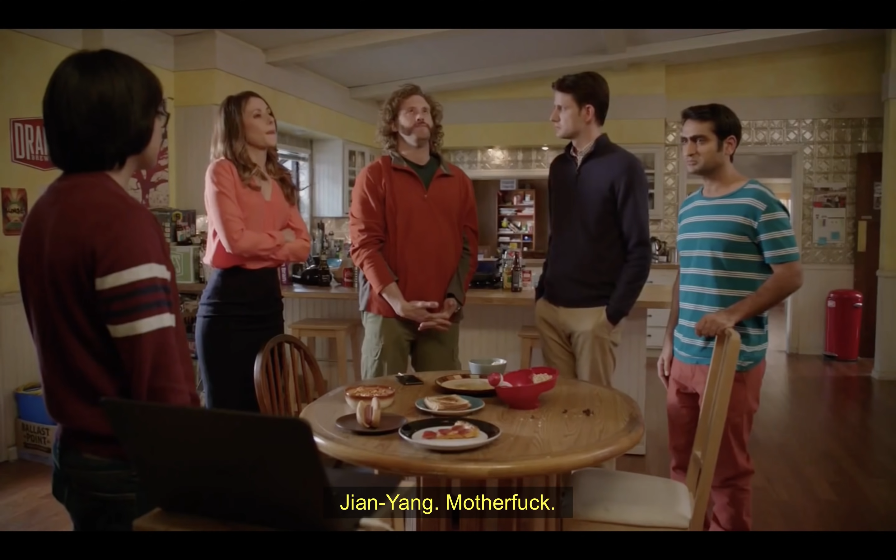
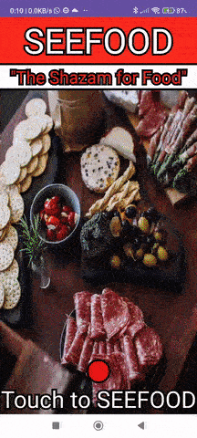

# SEEFOOD-APP

A silicon valley parody app that tells you if your food is a hotdog or not a hotdog, using state of the art machine learning.

The app is built using Android SDK and Java.

The server that runs the machine learning model is built using Flask and Python.

You can find the `seefood-server` repository [here](https://github.com/ShlomiRex/seefood-server).

Link to youtube video to watch this scene: [here](https://www.youtube.com/watch?v=vIci3C4JkL0).

# My app

